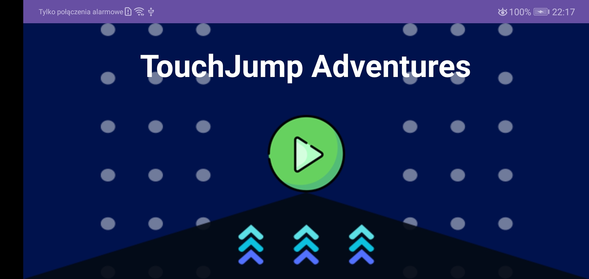
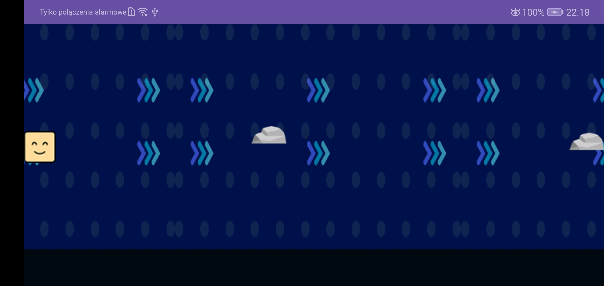

# Dokumentacja gry TouchJump Adventure
## Wprowadzenie 
TouchJump Adventures to prosta, ale wciągająca gra platformowa dla systemu Android. Gra oferuje dynamiczną rozgrywkę, w której gracz steruje skaczącym kwadratem, unikając przeszkód. Gra została stworzona z myślą o zapewnieniu zabawy i wyzwania dla graczy w różnym wieku.

## Cel gry 
Celem gry "TouchJump Adventures" jest unikanie przeszkód i przetrwanie jak najdłużej, wymagając od gracza szybkich reakcji i precyzyjnych skoków, aby uniknąć zderzenia i przejście jak najdalej. 

## Mechanika gry 

### Sterowanie 
Gracz steruje kwadratem, dotykając ekranu urządzenia. Dotknięcie ekranu powoduje skok kwadratu.  

### Przeszkody 
Podczas gry gracz musi unikać przeszkód, takich jak kamienie, które poruszają się w kierunku kwadratu. Kolizja z przeszkodą kończy grę. 

### Zaczynając grę 
Po uruchomieniu gry gracz zostanie przywitany ekranem startowym, na którym będzie mógł rozpocząć grę, dotykając przycisku "Start Game". 

## Layout Aplikacji

### XML 

androidx.constraintlayout.widget.ConstraintLayout: 

- Jest to rodzaj kontenera, który umożliwia definiowanie relacji pomiędzy elementami w układzie interfejsu użytkownika. 
- Parametry layout_width i layout_height ustawione na match_parent oznaczają, że kontener będzie rozciągał się na cały dostępny obszar ekranu. 
- android:background="@drawable/menu" ustawia tło kontenera na obrazek zasobu o nazwie menu. 

TextView o id Title: 
- Jest to pole tekstowe wyświetlające tytuł gry. 
- Ustawione są właściwości tekstu, takie jak kolor, styl, rozmiar oraz sam tekst. 
- Element jest skonfigurowany w celu umieszczenia go w centrum ekranu za pomocą atrybutów layout_constraint*. 

ImageButton o id Help: 
- Jest to przycisk obrazkowy, który będzie działał jako przycisk rozpoczęcia gry. 
- Ustawione są wymiary przycisku oraz odstępy od krawędzi ekranu. 
- Parametr android:onClick="StartGame" wskazuje metodę w MainActivity, która zostanie wywołana po kliknięciu przycisku. 
- app:srcCompat="@drawable/play" ustawia obrazek przycisku na zasób o nazwie play. 

Ten układ interfejsu użytkownika zawiera podstawowe elementy potrzebne do rozpoczęcia gry: tytuł gry i przycisk rozpoczęcia. Używając ConstraintLayout, elementy są ustawione w sposób dynamiczny, co pozwala na elastyczne dostosowanie ich do różnych rozmiarów ekranu i orientacji urządzenia. 
  

## Logika biznesowa aplikacji
### AppConstants.java
Plik AppConstants odpowiada za zarządzanie globalnymi ustawieniami, zasobami graficznymi oraz dostępem do elementów gry.

W sekcji deklaracji zmiennych i stałych znajdują się:  
- bitmapbank: Obiekt BitmapBank, który przechowuje zasoby graficzne gry, na przykład tekstury postaci czy tekstury przeszkód.
- gameEngine: Obiekt GameEngine, odpowiedzialny za zarządzanie logiką gry, w tym zarządzanie stanem gry, interakcjami oraz renderowaniem.
- SCREEN_WIDTH i SCREEN_HEIGHT: Stałe przechowujące szerokość i wysokość ekranu.
- gravity: Stała przechowująca wartość grawitacji w grze.  
- jumpVelocity: Stała przechowująca prędkość skoku postaci.  
- activity: Referencja do GameActivity, głównej aktywności gry.

Metoda setActivity(GameActivity activity) służy do ustawiania referencji do głównej aktywności gry (GameActivity) w klasie AppConstants.  
Metoda initialization(Context context) inicjalizuje stałe i obiekty gry na podstawie danego kontekstu. W ramach tej metody:  
- setScreenSize(context) ustawia rozmiar ekranu na podstawie dostępnego Context.  
- Tworzony jest nowy obiekt BitmapBank, który wykorzystuje zasoby (Resources) dostępne w context.  
- Inicjalizowany jest GameEngine, który używa głównej aktywności gry (AppConstants.activity).  
- Ustawiane są wartości dla gravity i jumpVelocity.  
- Metoda getBitmapBank() zwraca obiekt BitmapBank, aby można było uzyskać dostęp do zasobów graficznych gry.  
- Metoda getGameEngine() zwraca obiekt GameEngine, który zawiera logikę i mechanikę gry.  
- Metoda pomocnicza setScreenSize(Context context) jest prywatna i służy do pobierania rozmiaru ekranu urządzenia. W ramach tej metody:  
- Uzyskiwany jest dostęp do WindowManager w celu uzyskania aktualnego Display.  
- Wykorzystywane są DisplayMetrics do pobrania szerokości i wysokości ekranu w pikselach.  
- Ustawiane są szerokość i wysokość ekranu w stałych SCREEN_WIDTH i SCREEN_HEIGHT w klasie AppConstants.

### BackgroundImage.java
Plik BackgroundImage definiuje prostą klasę w języku Java. Klasa ta służy do reprezentowania obrazu tła w grze, przechowując jego pozycję (X, Y) oraz prędkość przesuwania. 
Klasa BackgroundImage zawiera trzy prywatne zmienne: backgroundImageX (pozycja X tła), backgroundImageY (pozycja Y tła) oraz backgroundImageVelocity (prędkość tła). 

- Konstruktor BackgroundImage inicjuje te zmienne ustawiając pozycję tła na (0, 0) i prędkość na 10. 

- Metody getX() i getY() są dostępne publicznie i służą do pobierania aktualnej pozycji tła w osi X i Y odpowiednio. Metody setX() i setY() są używane do ustawiania nowych wartości pozycji tła. 

- Metoda getVelocity() zwraca aktualną prędkość przesuwania tła. Klasa BackgroundImage może być używana jako podstawowa struktura do manipulowania obrazem tła w grze.

### BitmapBank.java
Plik BitmapBank jest odpowiedzialny za zarządzanie bitmapami używanymi w grze. Składa się z kilku metod, które wczytują i manipulują bitmapami tła, przeszkód oraz postaci.

Klasa BitmapBank ma pole background, które przechowuje bitmapę tła gry, oraz tablice stone i square, przechowujące odpowiednio bitmapy kamieni i kwadratów. 

- Konstruktor klasy BitmapBank przyjmuje zasoby (Resources) jako parametr. W konstruktorze, bitmapa tła jest wczytywana z zasobów (res) i następnie skalowana przy użyciu metody scaleImage. Bitmapy kwadratów i kamieni są również wczytywane z zasobów i umieszczane odpowiednio w tablicach square i stone. 

- Metoda getSquare(int frame) zwraca bitmapę kwadratu (postaci) z tablicy square dla danego frame (jednakże implementacja metody ma błąd i zawsze zwraca square[0]). 

- Metody getSquareWidth() i getSquareHeight() zwracają szerokość i wysokość bitmapy kwadratu (postaci) z tablicy square. 

- Metoda getBackground() zwraca bitmapę tła. 

- Metody getBackgroundWidth() i getBackgroundHeight() zwracają szerokość i wysokość bitmapy tła. 

- Metoda scaleImage(Bitmap bitmap) jest używana do skalowania bitmapy tła. Szerokość i wysokość bitmapy tła są dostosowywane proporcjonalnie do wysokości ekranu (AppConstants.SCREEN_HEIGHT), aby bitmapa tła miała odpowiednie proporcje. 
  
- Metoda getStone(int frame) zwraca bitmapę kamienia z tablicy stone dla danego frame (ale również zawiera błąd i zawsze zwraca stone[0]). 

- Metody getStoneWidth() i getStoneHeight() zwracają szerokość i wysokość bitmapy kamienia z tablicy stone.

### GameActivity.java
Plik GameActivity definiuje główną aktywność gry, która tworzy i zarządza widokiem gry. 

- Metoda onCreate() jest przesłoniętą metodą z klasy bazowej Activity, która jest wywoływana podczas tworzenia aktywności. W metodzie onCreate() najpierw wywoływana jest metoda bazowa super.onCreate(savedInstanceState),
  aby zainicjować domyślne zachowanie aktywności. Następnie tworzony jest nowy obiekt GameView przypisany do pola gameView za pomocą new GameView(this). Obiekt GameView jest odpowiedzialny za renderowanie i obsługę logiki gry.
  Ostatnim krokiem w metodzie onCreate() jest ustawienie widoku aktywności na gameView za pomocą setContentView(gameView). To sprawia, że głównym elementem interfejsu użytkownika w tej aktywności jest GameView, który reprezentuje graficzny interfejs gry. 

Plik GameActivity jest podstawową aktywnością aplikacji, która inicjuje i zarządza głównym widokiem gry oraz obsługuje cykl życia aktywności Androida, tak aby umożliwić poprawne działanie gry na urządzeniach mobilnych. 

### GameEngine.java
Klasa GameEngine jest częścią aplikacji TouchJump Adventures odpowiedzialną za logikę gry. Zawiera ona metody do aktualizacji stanu gry oraz rysowania elementów na ekranie, takich jak tło, kwadratowy bohater (square) 
oraz przeszkody w postaci kamieni (StoneObstacle).

- Konstruktor klasy GameEngine inicjuje obiekty tła (backgroundImage), bohatera (square), oraz listę przeszkód (obstacles). Ustawia także stan gry na 0 (początkowy stan gry). 

- Metoda updateAndDrawBackgroundImage aktualizuje i rysuje tło gry na podstawie przesunięcia (velocity) tła. Pozwala tle poruszać się w lewo, a gdy wyjdzie poza ekran, przesuwa je z powrotem. Rysuje tło na ekranie, aby wypełnić całą szerokość ekranu. 

- Metoda updateAndDrawSquare zarządza aktualizacją i rysowaniem bohatera (square) na ekranie w zależności od stanu gry. Głównie odpowiada za opadanie bohatera zgodnie z siłą grawitacji oraz wykrywanie kolizji z przeszkodami. 

- Metoda updateAndDrawStoneObstacle zarządza aktualizacją i rysowaniem przeszkód (kamieni) na ekranie. Przesuwa przeszkody w lewo oraz usuwa te, które wyszły poza ekran. 

- Metoda generateObstacles generuje nowe przeszkody (kamienie) na podstawie losowych wartości. Dodaje nowe przeszkody do listy obstacles na prawym krańcu ekranu. 

Inne elementy:

- isFalling i isJumping określają, czy bohater spada lub skacze. 

- targetY określa docelową wysokość dla bohatera. 

- gameState definiuje stan gry (1 - gra aktywna, 0 - gra zatrzymana). 

- updateAndDrawSquare oraz updateAndDrawStoneObstacle wykorzystują Canvas do rysowania elementów gry. 

Klasa GameEngine kontroluje główne elementy gry, takie jak ruch postaci, kolizje z przeszkodami oraz generowanie nowych przeszkód. Jest ona integralną częścią implementacji logiki gry w aplikacji TouchJumpAdventures. 

### GameThread.java 

W sekcji deklaracji zmiennych i stałych znajdują się:
- SurfaceHolder surfaceHolder - Przechowuje obiekt SurfaceHolder, który umożliwia dostęp i kontrolę nad powierzchnią rysowania. 
- public static boolean isTrue = true - Zmienna statyczna wskazująca, czy ma być generowana nowa przeszkoda. Początkowo ustawiona na wartość true. 
- boolean isRunning - Zmienna informująca, czy wątek gry jest uruchomiony. 
- long startTime, loopTime - Zmienne przechowujące czas rozpoczęcia iteracji pętli oraz czas trwania jednej iteracji. 
- long DELAY = 20: - Stała określająca opóźnienie w pętli głównej w milisekundach. 

Konstruktor public GameThread(SurfaceHolder surfaceHolder) - Przyjmuje obiekt SurfaceHolder i inicjalizuje pole surfaceHolder.
Ustawia flagę isRunning na true. 
Metoda run(): 

Metoda główna wątku, w której odbywa się główna pętla gry. 
Aktualizuje logikę gry i rysuje elementy gry na ekranie. 
Monitoruje czas wykonania jednej iteracji pętli i zapewnia stałe opóźnienie pomiędzy iteracjami. 
Generuje nową przeszkodę tylko wtedy, gdy gra jest w stanie 1 (czyli gra się rozpoczęła) i zmienna isTrue jest ustawiona na true. 
Metody dostępowe isRunning() i setIsRunning(boolean state): 

Pozwalają na dostęp do stanu działania wątku (isRunning) oraz ustawienie tego stanu (setIsRunning). 
Wątek gry jest kluczowym elementem gry, który zarządza logiką i rysowaniem, zapewniając płynne i sprawnie działające doświadczenie gry. 

### GameView.java 
Konstruktor public GameView(Context context) - Inicjalizuje widok gry poprzez wywołanie metody initView(). 

Metoda initView():

- Pobiera SurfaceHolder z widoku i ustawia bieżącą instancję jako obiekt nasłuchujący (callback) zdarzeń powierzchni (SurfaceHolder.Callback). 
- Ustawia widok jako możliwy do uzyskania focusu. 
- Tworzy nową instancję GameThread przekazując mu SurfaceHolder. 

Metoda surfaceCreated(SurfaceHolder holder):
- Tworzy nową wątkową instancję GameThread tylko jeśli aktualnie nie jest uruchomiona.
 
Metoda surfaceChanged(SurfaceHolder holder, int format, int width, int height):
- Jest pusta i nie wykonuje żadnych działań. Może być użyta do dostosowywania widoku w przypadku zmiany rozmiaru powierzchni. 

Metoda surfaceDestroyed(SurfaceHolder holder) :
- Wywoływana, gdy powierzchnia jest zniszczona. Zatrzymuje wątek gry i czeka na jego zakończenie. 

Metoda onTouchEvent(MotionEvent event):
- Obsługuje zdarzenia dotykowe na ekranie. 
- Sprawdza, czy od ostatniego dotknięcia minęło wystarczająco dużo czasu. 
- W przypadku zdarzenia ACTION_DOWN (gdy użytkownik nacisnął na ekran), ustawia stan gry na 1 i ustawia prędkość kwadratu na wartość skoku (AppConstants.jumpVelocity). 
- Zwraca wartość true w celu zakończenia obsługi zdarzenia. 

Klasa GameView jest istotnym elementem w strukturze gry, odpowiedzialnym za obsługę wyświetlania oraz interakcji z użytkownikiem poprzez dotyk. 

### MainActivity.java

public static Context context; 
- Deklaracja zmiennej statycznej context typu Context, która będzie przechowywać kontekst aplikacji. 

Metoda onCreate(Bundle savedInstanceState): 
- Jest to metoda cyklu życia, która jest wywoływana, gdy aktywność jest tworzona. 

Pierwsze wywołanie super.onCreate(savedInstanceState) wykonuje podstawowe inicjalizacje przez klasę bazową AppCompatActivity. 
setContentView(R.layout.activity_main) ustawia układ interfejsu użytkownika, który jest zdefiniowany w pliku XML o nazwie activity_main.

AppConstants.initialization(this.getApplicationContext()) wykonuje inicjalizację stałych i zasobów aplikacji.

context = this; ustawia zmienną context na bieżącą aktywność.

Metoda StartGame(View view): 
- Jest to metoda obsługująca kliknięcie przycisku rozpoczęcia gry (Start Game). 
- Tworzy nowe Intent, który ma uruchomić aktywność GameActivity. 

startActivity(intent) - rozpoczyna aktywność GameActivity. 

finish() - zamyka bieżącą aktywność MainActivity. 

Klasa MainActivity pełni rolę ekranu startowego aplikacji, gdzie użytkownik może rozpocząć grę, a po kliknięciu przycisku, jest przenoszony do GameActivity, gdzie właściwa gra się odbywa. 

### Square.java 

private int squareX, squareY, currentFrame, velocity; - Deklaracja prywatnych zmiennych squareX, squareY, currentFrame i velocity, które będą przechowywać informacje o położeniu kwadratu, aktualnej klatce animacji oraz prędkości. 

public static int maxFrame; - Deklaracja statycznej zmiennej maxFrame, która określa maksymalną liczbę klatek animacji. 

Konstruktor public Square() { ... } 
- Tworzy nowy obiekt typu Square. 
- Ustawia początkowe wartości zmiennych squareX, squareY, currentFrame, maxFrame oraz velocity. 

Metody dostępowe (getVelocity(), setVelocity(), getCurrentFrame(), setCurrentFrame(), getX(), getY(), setX(), setY()) - Pozwalają na odczyt i ustawianie wartości zmiennych 
- velocity,
- currentFrame, 
- squareX,
- squareY

### StoneObstacle.java
Ten kod definiuje klasę StoneObstacle, która reprezentuje przeszkodę w grze. Oto opis poszczególnych części kodu: 

private int stoneX, stoneY, currentFrame, velocity; - Deklaracja prywatnych zmiennych stoneX, stoneY, currentFrame i velocity, które będą przechowywać informacje o położeniu przeszkody, aktualnej klatce animacji oraz prędkości. 

public static int maxFrame; - Deklaracja statycznej zmiennej maxFrame, która określa maksymalną liczbę klatek animacji. 

Konstruktor public StoneObstacle() { ... }
- Tworzy nowy obiekt typu StoneObstacle. 
- Ustawia początkowe wartości zmiennych stoneX, stoneY, currentFrame, maxFrame oraz velocity. 
- Metody dostępowe (getX(), getY(), setX(), setY()) 
- Pozwalają na odczyt i ustawianie wartości zmiennych stoneX i stoneY. 

Metoda update() - Aktualizuje położenie przeszkody poprzez zmniejszenie wartości stoneX o 70 jednostek. Oznacza to, że przeszkoda będzie poruszać się w lewo. 
